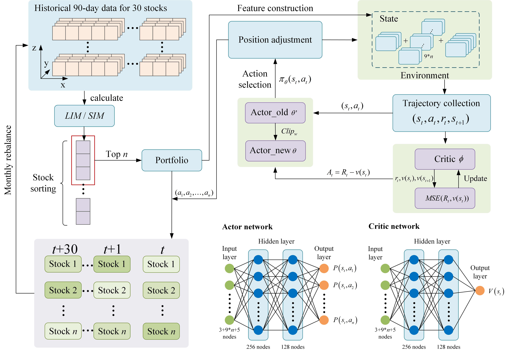

# Dancing with markets: A dynamic rebalancing mechanism using deep reinforcement learning for online portfolio selection


# DASRL Long Mode: LIM-PPO Portfolio Optimization Framework

A reinforcement learning stock selection and portfolio optimization strategy based on the Long Intensity Measure (LIM) for long-only trading.

### Stock Group Types
The system supports three stock group types:
- **TOP**: Top group, selects n stocks with highest LIM values
- **MIDDLE**: Middle group, selects n stocks with median LIM values
- **LOW**: Low group, selects n stocks with lowest LIM values
  
### Training
Train with different stock group types:

```bash
# Train with Top group (highest LIM stocks)
python main.py --mode train --config config/default.yaml --group_type TOP

# Train with Middle group (median LIM stocks)
python main.py --mode train --config config/default.yaml --group_type MIDDLE

# Train with Low group (lowest LIM stocks)
python main.py --mode train --config config/default.yaml --group_type LOW
```

### Testing
```bash
# Basic test
python main.py --mode test --config config/default.yaml --visualize

# Test with specific date range
python main.py --mode test --start_date 2024-04-06 --end_date 2025-04-06 --config config/default.yaml --visualize --group_type TOP
python main.py --mode test --start_date 2024-04-06 --end_date 2025-04-06 --config config/default.yaml --visualize --group_type MIDDLE
python main.py --mode test --start_date 2024-04-06 --end_date 2025-04-06 --config config/default.yaml --visualize --group_type LOW
```
# DASRL Short Mode: SIM-PPO Portfolio Optimization Framework

A reinforcement learning stock selection and portfolio optimization strategy based on the Short Intensity Measure (SIM) for short-selling trading.

### Stock Group Types
The system supports three stock group types:
- **TOP**: Top group, selects n stocks with highest SIM values (best short candidates)
- **MIDDLE**: Middle group, selects n stocks with median SIM values
- **LOW**: Low group, selects n stocks with lowest SIM values

### Training
Train short-selling strategy with NASDAQ Semiconductor stocks:

```bash
# Train with Top group (highest SIM stocks)
python main.py --mode train --config config/nasdaq_semiconductor.yaml --group_type TOP

# Train with Middle group (median SIM stocks)
python main.py --mode train --config config/nasdaq_semiconductor.yaml --group_type MIDDLE

# Train with Low group (lowest SIM stocks)
python main.py --mode train --config config/nasdaq_semiconductor.yaml --group_type LOW
```

### Testing
```bash
# Basic test
python main.py --mode test --config config/nasdaq_semiconductor.yaml --visualize --group_type TOP

# Test with specific date range
python main.py --mode test --start_date 2024-04-06 --end_date 2025-04-06 --config config/nasdaq_semiconductor.yaml --visualize --group_type TOP
python main.py --mode test --start_date 2024-04-06 --end_date 2025-04-06 --config config/nasdaq_semiconductor.yaml --visualize --group_type MIDDLE
python main.py --mode test --start_date 2024-04-06 --end_date 2025-04-06 --config config/nasdaq_semiconductor.yaml --visualize --group_type LOW
```
